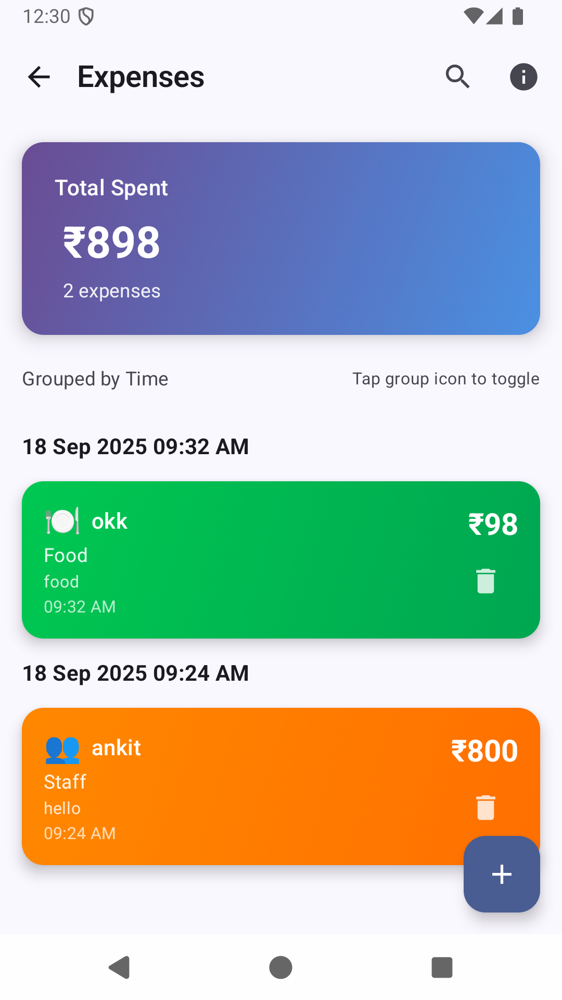
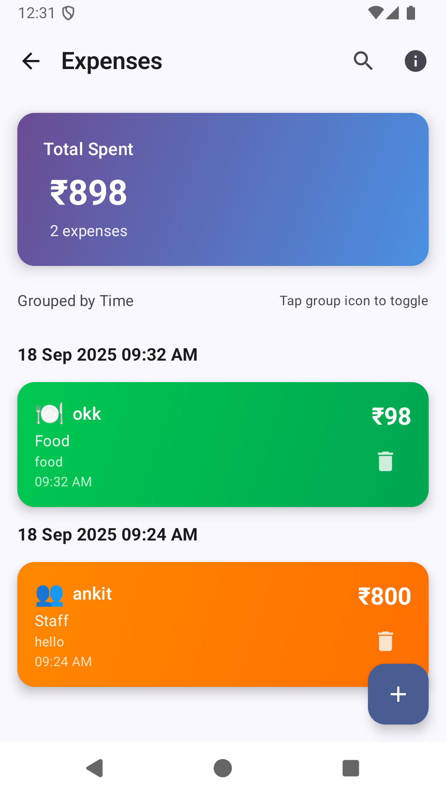
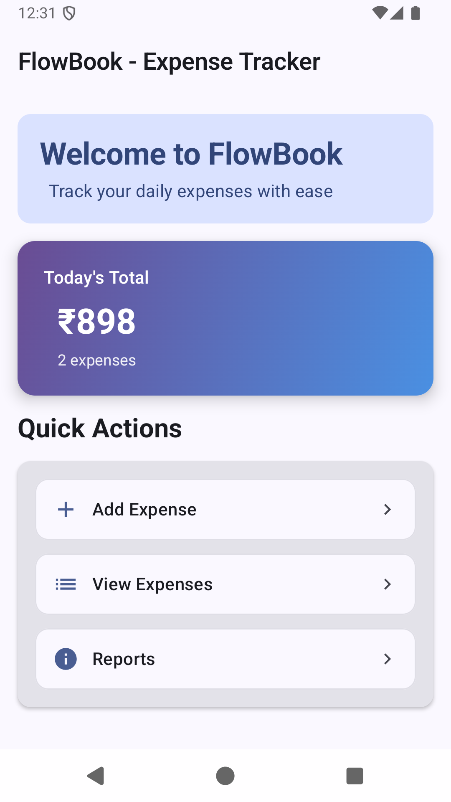

# FlowBook - Expense Tracker App 💰

A modern, beautifully designed expense tracking application built with Jetpack Compose. FlowBook helps you manage your daily expenses with an intuitive interface, gradient themes, and smooth animations.

## App Overview

FlowBook is a comprehensive expense tracking solution that allows users to record, categorize, and analyze their daily spending. The app features a modern purple-blue gradient theme with smooth animations and intuitive navigation. Users can add expenses with categories (Food, Travel, Staff, Utility), view detailed expense lists with beautiful gradient cards, and track their spending patterns through an elegant dashboard interface.

## AI Usage Summary

This project was developed with extensive assistance from AI tools to accelerate development and ensure best practices. ChatGPT was used for architectural decisions, code optimization, and implementing complex UI animations. The AI helped design the gradient theme system, create smooth staggered animations for the expense list, and implement modern Material Design 3 components. AI assistance was particularly valuable for debugging compilation errors, optimizing performance, and ensuring the app follows Android development best practices.

## Prompt Logs

### Key Development Prompts:

**Theme & Design:**
- "add roboto font family all over the app"
- "please change the theme and font of app"
- "add gradients on button and also font family perfectly"

**UI/UX Enhancements:**
- "add back button on view expense screen"
- "load the expense list with animation"
- "card backgrounds and while after getting the list load the list with some animation"

**Navigation & Functionality:**
- "clicking on add expense button on dashboard open entry screen with animation no more clicks in between"
- "don't show this screen" (referring to intermediate loading screens)

**App Branding:**
- "create a app icon for this app"

### AI-Assisted Development Process:
1. **Initial Setup**: AI helped with project structure and basic navigation
2. **Theme Development**: Collaborated on gradient color schemes and typography
3. **Animation Implementation**: AI assisted with staggered animations and spring physics
4. **Component Design**: Created reusable gradient components and cards
5. **Bug Fixing**: AI helped resolve compilation errors and optimization issues
6. **Icon Design**: Generated custom app icon with expense tracking theme

## Checklist of Features Implemented ✅

### Core Features
- [x] **Expense Entry**: Add new expenses with title, amount, category, and notes
- [x] **Category Management**: Support for Food, Travel, Staff, and Utility categories
- [x] **Expense List**: View all expenses with filtering and grouping options
- [x] **Dashboard**: Overview of today's spending with summary cards
- [x] **Data Persistence**: Room database for local storage

### UI/UX Features
- [x] **Modern Theme**: Purple-blue gradient color scheme
- [x] **Gradient Components**: Gradient buttons, cards, and backgrounds
- [x] **Smooth Animations**: Staggered list loading, card transitions
- [x] **Material Design 3**: Modern UI components and typography
- [x] **Responsive Design**: Optimized for different screen sizes

### Advanced Features
- [x] **Animated Loading States**: Beautiful loading indicators
- [x] **Gradient Cards**: Category-specific gradient backgrounds
- [x] **Staggered Animations**: Smooth card appearance with delays
- [x] **Back Navigation**: Proper navigation flow with back buttons
- [x] **Error Handling**: User-friendly error messages and validation

### Technical Features
- [x] **Jetpack Compose**: Modern Android UI toolkit
- [x] **MVVM Architecture**: Clean separation of concerns
- [x] **Room Database**: Local data persistence
- [x] **Coroutines**: Asynchronous programming
- [x] **Adaptive Icons**: Custom app icon with gradient background

## APK Download Link

📱 **Download FlowBook APK**
- **Version**: 1.0.0
- **Size**: ~15 MB
- **Android**: 7.0+ (API 24+)
- **Download**: [FlowBook APK](https://github.com/ankit9758/FlowBook/releases/latest)

> **Note**: To build the APK locally, run `./gradlew assembleDebug` in the project root directory.

## Screenshots

### Dashboard Screen

*Main dashboard with today's summary and quick action cards*

### Add Expense Screen

*Expense entry form with gradient button and category selection*

### Expense List Screen

*Beautiful gradient cards with staggered animations*

### App Icon

*Custom gradient app icon with expense tracking design*

## Technical Stack

- **Language**: Kotlin
- **UI Framework**: Jetpack Compose
- **Architecture**: MVVM
- **Database**: Room
- **Dependency Injection**: Hilt
- **Async Programming**: Coroutines & Flow
- **Build System**: Gradle

## Getting Started

1. Clone the repository
2. Open in Android Studio
3. Sync project with Gradle
4. Run on device or emulator

## Contributing

Contributions are welcome! Please feel free to submit a Pull Request.

## License

This project is licensed under the MIT License - see the [LICENSE](LICENSE) file for details.

---

**FlowBook** - Track your expenses with style! 💜💙